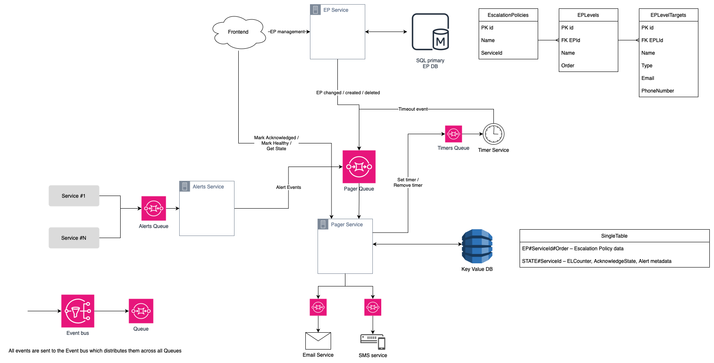

## How to run
You can use Docker:

Build an image: `docker build -t aircall . `\
Run container: `docker run --name aircall-pager aircall`\
List of containers: `docker ps -a`\
Restart container: `docker start -ai {container-id-from-list}`

To run without Docker make sure you have installed NodeJs LTS:\
`npm i`\
`npm test`

## System Design
I chose a simple event driven architecture for async communication between decoupled services.\
The key decisions here are:
* Data redundancy (duplication) in Pager DB
* Every service is connected to its own queue
* Every service sends events through the common Event Bus. 
* Retry mechanism is incapsulated into Queue implementation

### Escalation Policy Service
It has its own type of database that suits it best. I chose SQL because of the nature of the data, CRUD operations, expected low throughput.

### Pager Service
Has NoSQL DB due to the need to match high event throughput, scalability, availability. This service does not use any aggregation. Eventual consistency is well suited for an event-driven architecture.

DB design must support optimistic locking, since our usecases involve concurrent operations.

### Alerts Service
Works as a proxy, sends alerts to the Pager Service.

### Timer Service
A purpose agnostic service with the sole purpose of deferring new events for a certain period of time with the possibility of canceling them. However, cancelation of pending events cannot be guaranteed due to the asynchronous architecture. Services that subscribe to pending events should check the relevance of the event once it arrives, rather than relying on a cancelation mechanism that is only intended to reduce workload.

### Notification Service
Notification target agnostic. It usually has low bandwidth due to limitations on 3d-party side. Using this service you have to optimize bandwidth.

### Frontend
Can manage EP through EP Service\
Can manage Services' alerts through Pager Service.